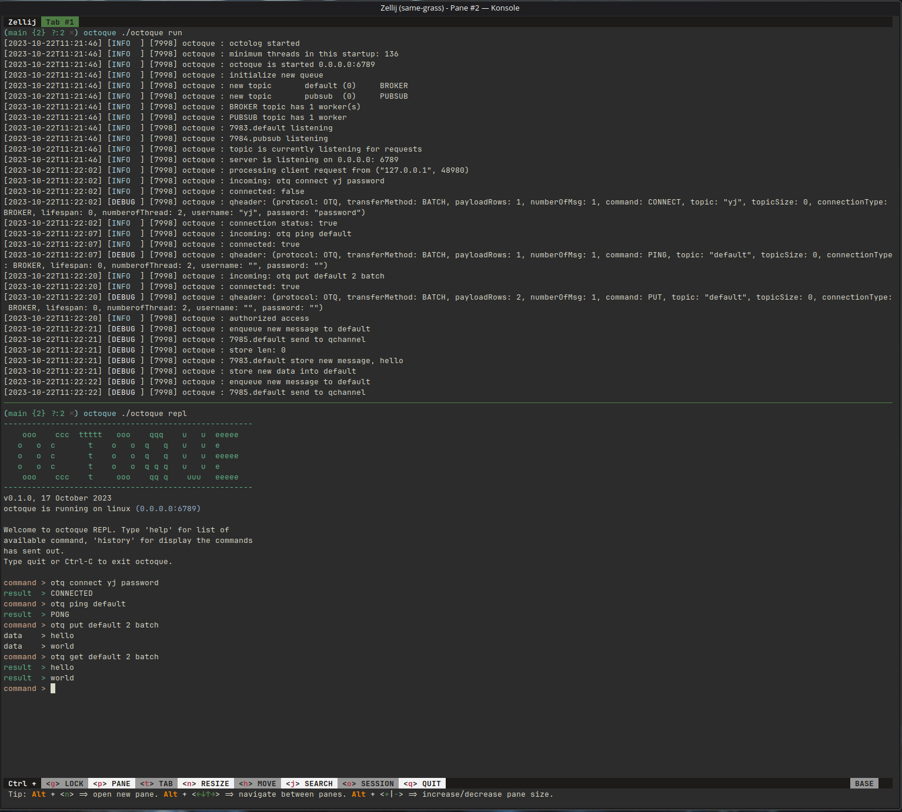

## Getting started guide

octoque currently is in active development and only support for linux. The getting started guide will be heavily depends on linux only.

### Pre-requiste

- nimlang 2.0, if you have not installed nim, you can follow it [here](https://nim-lang.org/install_unix.html)

- [octolog](https://github.com/jaar23/octolog) (another project of mine, to allow logging in multi thread application)

- `libsodium` is required for the authentication feature, you can install it by

  fedora / red hat enterprise linux
  ```shell
  sudo yum install libsodium -y
  ```

  macos
  ```shell
  brew install libsodium
  ```

  ububtu / deb based distro
  ```
  sudo apt-get update -y

  sudo apt-get install -y libsodium-dev
  ```

### Installing

building from source is the only method for now.

```shell
git clone https://github.com/jaar23/octoque.git

cd octoque

nimble build

chmod +x octoque
```

### Running the application

you can place `octoque` binary to an excutable folder `(/usr/local/bin)` or adding it to the environment variable or running it directly by

```
./octoque run
```
Example



view more option by running

```shell
## all command
./octoque -h

## run command
./octoque run -h

## administrative command
./octoque adm -h

## repl command
./octoque repl -h
```
There are always two queue topic by default `default` and `pubsub`. `default` topic is running as a  BROKER connection type while `pubsub` is running as PUBSUB connection type.

Find out more about [message structure](./message-structure.md)

Find out more about [message command](./message-command.md)
